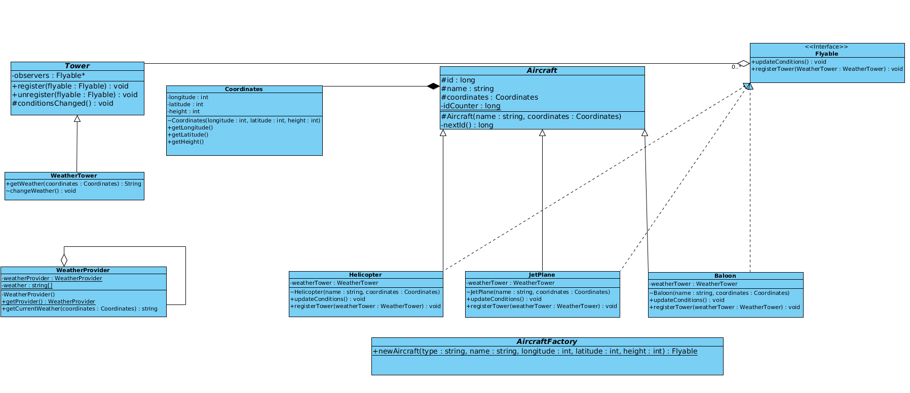

# Avaj-Launcher

*This is the first project of the Java branch at School 42.*

Simple aircraft logistics simulation program based on the provided UML class diagram. All classes are required to be implemented respecting every detail provided in the diagram.



## Description

This project is intended to teach a student: 
- the basics of Java development
- interpreting UML class diagrams
- implementing object-oriented design patterns (Observer, Singleton, Factory)
- working with files
- error management

The program takes one and only one argument from the command line. This argument represents the name of a text file that will contain the scenario needs to be simulated. The program execution generates a file
[scenario.txt](https://github.com/irinadeeva/Avaj-Launcher/blob/master/scenario.txt)
that describes the outcome of the simulation.

Scenario file
The first line of the file contains a positive integer number. This number represents the number of times the simulation is run. 
Each following line describes an aircraft that will be part of the simulation, with this format: TYPE NAME LONGITUDE LATITUDE HEIGHT.

Each run, the Weather Tower provides updated weather conditions for every aircraft and its coordinates. And aircraft react with changing coordinates by specified step and logging a message to the simulation file, the message corresponds to the weather. If the height of an aircraft reaches 0, it lands and unregisters from the Tower, thus stopping its participation.

**Detailed description of the task: [avaj-launcher.en.pdf](https://github.com/irinadeeva/Avaj-Launcher/blob/master/docs/en.subject.pdf)**

## Usage

Compile and run the program with the script **compileProject.sh**. A program takes a path to a scenario file as a single parameter. By default, it looks for *scenario.txt* in the *src* dir. 

```
SCENARIO INPUT FILE FORMAT:
A) First line: <PositiveInt>
               (NumberOfSimulationsToRun)
B) All following lines - list of participating aircrafts in format:
    <String> <String> <PositiveInt> <PositiveInt> <PositiveInt>
     (Type)   (Name)   (Longitude)   (Latitude)     (Height)
  
* 3 types of aircraft are available: Helicopter, JetPlane, Baloon.
  ```

For example:

```
25
Baloon B1 2 3 20
Baloon B2 1 8 66
JetPlane J1 23 44 32
Helicopter H1 654 33 20
Helicopter H2 22 33 44
Helicopter H3 98 68 99
Baloon B3 102 22 34
JetPlane J2 11 99 768
Helicopter H4 223 23 54
```

From this input, the program generated this simulation log file: [simulation.txt](https://github.com/dstepanets/Avaj-Launcher/blob/master/src/simulation.txt).

For example:

```
```

